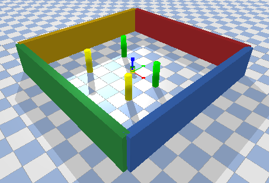

# turtlebotRL

### Code Authors: Vinit Sarode & Abhimanyu

## Contents
This repository contains the gym env setup for **turtlebot** and a ppo implementation for go to goal task. The file are:

  * **TurtlebotGymEnv**: The gym-env
  * **turtlebot**: sets up the major funtions needed by the gym-env
  * **turtlebot_lidar**: Generates LIDAR data using ray-casting
  * **world_env**: Adds the obstacles and walls in the world frame
  * **test**: Test script for this env

  * **/ppo**: PPO implementation for go to goal task

